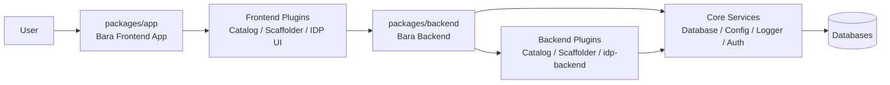
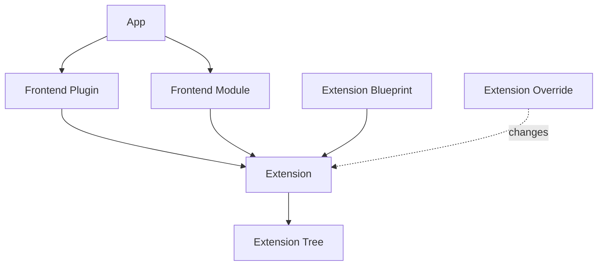

# Backstage Architecture Knowledge

## 1. 目的

このドキュメントは、Bara Developer Platform を Backstage ベースの Internal Developer Platform (IDP) として発展させるための設計判断メモである。単なる概念説明ではなく、次を判断するための基準を整理する。

- どの機能を新規 Plugin / Module / Extension / Extension Point として作るか。
- Core Plugin や Backstage 生成アプリをどこまで変更してよいか。
- OSS Plugin 互換性と Backstage アップデート追従性をどう維持するか。
- Project / Environment / Template / Approval などの IDP 独自機能をどこに置くか。

本文では、**公式ドキュメントに書かれていること**と、そこから導く**このプロジェクトでの判断**を分けて記述する。公式仕様や API は Backstage のバージョンで変化し得るため、実装時は必ず対象バージョンの公式ドキュメントと package の型定義を確認する。

## 2. Backstage 全体像

### 2.1 公式ドキュメントから読み取れること

Backstage は、開発者ポータルを構築するためのフレームワークであり、Software Catalog を中心にツール、サービス、ドキュメント、テンプレートなどを統合する。公式の Architecture Overview では、Backstage の frontend app と backend はそれ自体が機能を直接持つのではなく、機能を提供する plugin や service を組み合わせる場所として説明されている。

- App は Backstage frontend application の root であり、直接の機能を持つというより、frontend plugin や extension を配線する。
- Backend は server-side の配線単位であり、backend plugin、core services、その他 service を組み立てる。
- 実際の機能は Plugin が提供する。
- Catalog / Scaffolder / Search / TechDocs なども Backstage の core feature であると同時に plugin として提供される。
- Backstage backend は複数 deployment に分けられるが、どの単位で分けるかはスケールや分離要件に依存する。



### 2.2 このプロジェクトでの判断

このリポジトリでは、`packages/app` と `packages/backend` を Bara の app / backend の所有境界として扱う。独自 IDP 機能の配置は、利用者 journey、責務の凝集性、共有範囲、テスト容易性、将来の変更コストで選ぶ。plugin / module は独立して再利用・配布・合成する機能に使う。

Backstage 本体や公式 plugin の内部実装をコピーして改造すると、OSS Plugin 互換性と Backstage アップデート追従性が下がる。そのため、基本方針は次の順序とする。

1. 既存 Plugin の設定で実現する。
2. 既存 Plugin が公開する Extension Point / Extension / Module で拡張する。
3. 独自 Frontend Plugin / Backend Plugin を作る。
4. どうしても必要な場合だけ、公式へ PR するか、Bara 側へ責務を移す。

## 3. Frontend System

### 3.1 構成要素

| 要素                     | 公式ドキュメントから読み取れる役割                                                                | このプロジェクトでの扱い                                                  |
| ------------------------ | ------------------------------------------------------------------------------------------------- | ------------------------------------------------------------------------- |
| App                      | Frontend application の root。plugin / extension を組み立てる場所。                               | Bara の app shell、代表 journey、共有 UI も所有する。                     |
| Frontend Plugin          | UI 機能をカプセル化する単位。ページ、navigation、API、他 plugin 向けの extension などを提供する。 | IDP の画面単位または体験単位を `plugins/` に作る。                        |
| Frontend Module          | 既存 frontend plugin に追加機能を提供する単位。                                                   | Catalog 画面への IDP card 追加など、既存 plugin に寄せる変更で使う。      |
| Extension                | App の extension tree に差し込まれる具体的な UI / 機能単位。                                      | ページ、カード、nav item、utility API 実装などを extension として考える。 |
| Extension Blueprint      | Extension を作るための型付き雛形。                                                                | 標準的な page / card / API などは blueprint を優先する。                  |
| Extension Override       | 既存 Extension の設定や実装を差し替える仕組み。                                                   | 既存 UI 差し替えの最小単位として使う。                                    |
| Extension Input / Output | Extension 同士を接続するための入出力。parent の input に child の output を渡す。                 | Frontend における実質的な拡張ポイントとして扱う。                         |
| Extension Tree           | App 内で extension が parent/child 関係で接続された木構造。                                       | App 全体の UI 合成結果として把握する。                                    |
| Utility API              | Plugin 間共有や app integrator による振る舞い差し替えのための API。                               | 認証、fetch、config、独自 client などの差し替え境界として使う。           |
| RouteRef                 | Plugin 間 routing の間接参照。Plugin が具体 URL を知らずに route 連携できる。                     | Frontend Plugin 間の結合を URL 直書きではなく RouteRef に寄せる。         |
| React Component          | 実際の UI 実装。                                                                                  | Bara の journey に密結合なら app、独立して再利用するなら plugin に置く。  |

### 3.2 Extension / Blueprint / Override / Module の関係

公式ドキュメントでは、frontend system は extension tree を構築し、extension の attachment point、input、output によって UI や機能を合成する。Extension Blueprint は extension を作るためのテンプレートであり、Extension Override は既存 extension の設定や実装を上書きするための仕組みである。

重要なのは、Frontend System には Backend System の `createExtensionPoint()` と同じ API はないこと。Frontend 側では、Extension の Input / Output と Extension Tree の接続関係が、実質的な拡張ポイントとして機能する。

また、`.override()` と `createFrontendModule()` は役割が異なる。

- `.override()` は、既存 Extension に対する変更内容を作る。
- `createFrontendModule()` は、その変更や追加 extension を「既存 plugin に追加する module」として App に組み込む単位にする。



### 3.3 このプロジェクトでの判断

IDP 固有 UI は、Bara の app shell / journey に密結合なら `packages/app` に、独立した機能境界を持つなら Frontend Plugin または Frontend Module に置く。既存 plugin の画面へ小さな UI を差し込む場合は Module / Extension を優先し、既存 extension の差し替えだけで済む場合は Extension Override を検討する。

Project / Environment / Template の UI は、案 A として `plugins/idp` に集約するか、案 B として `plugins/idp-project` / `plugins/idp-environment` / `plugins/idp-template` に分ける。ただし分割基準は「画面名」だけではなく、独立した機能境界・リリース境界・利用者体験があるかで判断する。

## 4. Backend System

### 4.1 構成要素

| 要素                          | 公式ドキュメントから読み取れる役割                                                                 | このプロジェクトでの扱い                                  |
| ----------------------------- | -------------------------------------------------------------------------------------------------- | --------------------------------------------------------- |
| Backend                       | Backend instance。backend feature を配線する deployment 単位。                                     | Bara の API、domain service、integration も所有できる。   |
| Backend Plugin                | 実際の backend 機能を提供する単位。Plugin 同士は独立しており、小さな microservice のように扱える。 | IDP の API / DB / 業務処理は `idp-backend` に置く。       |
| Backend Module                | 既存 plugin が公開する extension point に機能を追加する単位。                                      | Scaffolder custom action などで使う。                     |
| Core Services                 | logger、database、config、auth、scheduler、cache、discovery など、backend が提供する共通 service。 | 独自実装では coreServices へ依存する。                    |
| Service Ref                   | Service を参照・注入するための識別子。                                                             | 独自 service を作る場合も型付き参照として扱う。           |
| Extension Point               | Plugin が module に公開する拡張口。                                                                | 独自 plugin には必要に応じて公開する。                    |
| Database Service              | Plugin ごとに scoped された knex client を取得する service。                                       | IDP の永続化は `idp-backend` の database service を使う。 |
| HTTP Router                   | Plugin の HTTP route を `/api/<pluginId>` 配下に登録する service。                                 | IDP API の公開に使う。                                    |
| Config                        | app-config を読む service。                                                                        | 環境差分や外部連携先は config に寄せる。                  |
| Logger                        | ログ出力 service。                                                                                 | plugin 内で直接 logger 実装を持たない。                   |
| Auth / UserInfo               | 認証・呼び出し元 user 情報を扱う service。                                                         | requester / approver の解決に使う。                       |
| Scheduler / Cache / Discovery | 定期実行、キャッシュ、他 plugin/backend の発見。                                                   | 実行履歴集計や外部 API 連携で必要になった時に使う。       |

### 4.2 Plugin 独立性とデータ境界

公式の Backend System Architecture では、backend plugin は互いに独立して動作し、plugin 間で通信が必要な場合は wire 越しに行うと説明されている。この制約により、各 plugin は小さな microservice のように扱える。

この考え方から、次の設計を避ける。

- 別 plugin の DB table を直接参照する。
- Plugin 間で DB JOIN する。
- 同じ transaction で扱うべきデータを複数 backend plugin に分断する。
- 責務境界が異なる plugin 間に、暗黙の横断 transaction を作る。

Plugin 間連携が必要な場合は、HTTP API、service、event、または plugin が公開する Extension Point などで連携する。同じ transaction で一貫性を保ちたい Project / Environment / Approval のようなデータは、同じ Backend Plugin に寄せる。

### 4.3 このプロジェクトでの判断

Project 管理、Environment 管理、Environment 作成申請、Approval、Execution History、Deployment Status はユースケース上の結合が強い。初期段階で `project-backend` / `environment-backend` / `approval-backend` に分けると、DB JOIN や distributed transaction が欲しくなりやすい。そのため、まずは `plugins/idp-backend` に集約する。

既存 Core Plugin に自分で Extension Point を追加することは、「既存 plugin が公開している拡張口を使う」のではなく「Core Plugin の改造」として扱う。必要な拡張口がない場合は、独自 plugin 側に責務を移すか、公式 Backstage へ提案・PR することを検討する。

## 5. Plugin / Module / Extension / Extension Point

| 概念               | Frontend                                                      | Backend                                                           | 判断基準                                               |
| ------------------ | ------------------------------------------------------------- | ----------------------------------------------------------------- | ------------------------------------------------------ |
| Plugin             | UI 機能・API client・extension を提供する単位。               | Backend 機能・HTTP API・DB 処理・extension point を提供する単位。 | 独立した機能境界を持つなら Plugin。                    |
| Module             | 既存 frontend plugin に extension / override を追加する単位。 | 既存 backend plugin の extension point に差し込む単位。           | 既存 plugin に追加する責務なら Module。                |
| Extension          | App の extension tree に挿入される UI / API / nav など。      | 同名概念は主役ではない。                                          | Frontend の合成単位。                                  |
| Extension Point    | Frontend では Input / Output が近い役割を持つ。               | Plugin が module に公開する拡張 API。                             | Backend で module に安全な追加口を提供したい時に作る。 |
| Extension Override | 既存 extension を差し替える変更。                             | なし。                                                            | 既存 UI の局所的な差し替え。                           |

### このプロジェクトでの判断

- 既存 Plugin が公開している Extension Point を使う: 拡張。
- 自分の Plugin に Extension Point を作る: 拡張。
- 既存 Core Plugin に新しい Extension Point を追加する: 改造。
- 既存 Core Plugin のロジックを書き換える: 改造。
- Frontend で既存 extension を `.override()` する: 局所的な拡張として扱えるが、差し替え対象の破壊的変更には注意する。
- Frontend Module と Backend Module は同じ名前でも役割が異なる。特に Backend Module は対象 plugin の Extension Point に依存する。

## 6. Frontend Plugin と Backend Plugin の対応関係

### 6.1 公式ドキュメントから読み取れること

Backstage の公式ドキュメントは、Frontend System と Backend System をそれぞれ独立した building blocks として説明している。Frontend Plugin は UI 機能を提供し、Backend Plugin は backend 機能を提供する。よくある構成として 1 つの frontend plugin が対応する backend plugin を呼ぶことはあるが、公式の構造上、1 対 1 が強制されているわけではない。

あり得る構成は次の通り。

- Frontend Plugin のみ: 静的 UI、外部 API を frontend から呼ぶ軽量機能など。
- Backend Plugin のみ: Webhook、scheduled job、外部連携、他 plugin 向け API など。
- 1 Frontend Plugin ↔ 1 Backend Plugin: Catalog や Scaffolder のように理解しやすい構成。
- 複数 Frontend Plugin → 1 Backend Plugin: 画面体験は分けるが、backend のデータ境界・transaction 境界は同じ場合。
- 1 Frontend Plugin → 複数 Backend Plugin: 画面が複数 backend の情報を集約する場合。

### 6.2 このプロジェクトでの判断

設計単位は「画面」ではなく、「機能境界・データ境界・transaction 境界」で考える。IDP の場合、Frontend は Project / Environment / Template の体験ごとに分けてもよい。一方で Backend は、Project / Environment / Approval が同じユースケースで強く結合し、同じ transaction で扱いたい可能性が高いため、まず `idp-backend` にまとめる選択肢が自然である。

```text
Frontend candidate A:
  plugins/idp  ───────────────┐
                              │
Backend:
  plugins/idp-backend  <──────┘

Frontend candidate B:
  plugins/idp-project     ────┐
  plugins/idp-environment ────┼──> plugins/idp-backend
  plugins/idp-template    ────┘
```

## 7. Core Feature 改造を避ける理由

### 7.1 判断基準

| やりたいこと                                              | 扱い        | 理由                                                                                        |
| --------------------------------------------------------- | ----------- | ------------------------------------------------------------------------------------------- |
| 既存 Plugin が公開している Extension Point を使う         | 拡張        | 公式に想定された追加口を使うため。                                                          |
| 既存 Plugin の設定で挙動を変える                          | 拡張        | Configuration first の範囲。                                                                |
| 自分の Plugin に Extension Point を作る                   | 拡張        | 自分が管理する互換性境界を定義するため。                                                    |
| Frontend Extension Override で既存 extension を差し替える | 拡張寄り    | 公開された frontend system の差し替え機構を使うため。ただし差し替え対象の変更に追従が必要。 |
| 既存 Core Plugin に新しい Extension Point を追加する      | 改造        | upstream にない API 面を fork 側で増やすため。                                              |
| 既存 Core Plugin の内部ロジックを書き換える               | 改造        | upstream 追従時に衝突し、OSS plugin 互換性を下げるため。                                    |
| 公式 Plugin の実装をコピーして独自変更する                | 改造 / fork | セキュリティ修正や破壊的変更の追従が難しくなるため。                                        |

### 7.2 このプロジェクトでの判断

Core Plugin 改造は原則避ける。必要に見える場合でも、次の代替策を先に検討する。

1. 公式 plugin の config / extension point / module で実現できないか。
2. 公式 plugin と疎結合に連携する独自 plugin を作れないか。
3. 独自 backend plugin に責務を移し、Catalog / Scaffolder とは API や参照で連携できないか。
4. 汎用性があるなら Backstage upstream へ issue / PR として提案できないか。

## 8. IDP 開発への適用方針

### 8.1 Backend

推奨案として、`idp-backend` を新規 Backend Plugin として作る。

責務候補:

- Project 管理
- Environment 管理
- Environment 作成申請
- Approval
- Execution History
- Deployment Status

Project / Environment / Approval は同じユースケースで強く結合するため、最初から `project-backend` / `environment-backend` / `approval-backend` に分けすぎない。分割が必要になるのは、データ所有権、運用責任、スケール要件、障害分離要件が明確になってからでよい。

### 8.2 Frontend

初期候補は次の 2 案とする。

案 A:

- `plugins/idp`
- `plugins/idp-backend`

案 B:

- `plugins/idp-project`
- `plugins/idp-environment`
- `plugins/idp-template`
- `plugins/idp-backend`

ただし、Backend はまず `idp-backend` に寄せる。Frontend の分割は navigation、利用者の認知負荷、リリース単位、既存 plugin への差し込み方で決める。

### 8.3 Catalog との関係

Catalog は Project / Environment の操作 DB ではなく、Software Catalog / 資産台帳として扱う。IDP DB は業務 transaction と申請状態を持ち、Catalog は entity の参照・検索・所有者情報の source として利用する。

- User は Catalog Entity の `user:default/name` のような entity ref で持つ。
- 申請 table には `requester_user_ref` / `approver_user_ref` のような参照を保存する。
- ユーザー詳細は必要時に Catalog / Auth / Identity 側から取得する。
- User 情報を IDP DB に二重管理しない。
- Project / Environment entity を Catalog に出す場合も、操作中の承認状態や transaction は IDP DB を source of truth とする。

### 8.4 Scaffolder との関係

Template 実行や repository 作成などは Scaffolder の活用を検討する。Scaffolder に独自処理を追加する場合は、Scaffolder Backend Module / custom action を優先する。Scaffolder 本体の改造は避ける。

IDP の申請承認と Scaffolder 実行を連携する場合は、例えば次の流れを検討する。

1. `idp-backend` が Environment 作成申請を受け付ける。
2. Approval が完了したら、`idp-backend` が Scaffolder API または適切な連携口を通じて template 実行を開始する。
3. 実行履歴や deployment status は `idp-backend` に保存し、必要に応じて Catalog entity ref と紐付ける。

## 9. 実装コード例

以下は設計イメージを示す最小例である。実際の package 構成では、Backstage の generator が作る package 名、export path、`/alpha` export の扱い、migration、test を対象バージョンに合わせて調整する。

### 9.1 `idp-backend` の最小実装

```ts
// plugins/idp-backend/src/plugin.ts
import {
  coreServices,
  createBackendPlugin,
  createExtensionPoint,
} from '@backstage/backend-plugin-api';
import { Router } from 'express';

export interface ApprovalPolicyContext {
  requesterUserRef: string;
  environmentRef: string;
}

export interface ApprovalPolicyDecision {
  approved: boolean;
  reason?: string;
}

export interface IdpApprovalPolicy {
  evaluate(context: ApprovalPolicyContext): Promise<ApprovalPolicyDecision>;
}

export interface IdpApprovalExtensionPoint {
  addApprovalPolicy(policy: IdpApprovalPolicy): void;
}

export const idpApprovalExtensionPoint =
  createExtensionPoint<IdpApprovalExtensionPoint>({
    id: 'idp.approval',
  });

export const idpPlugin = createBackendPlugin({
  pluginId: 'idp',
  register(env) {
    const approvalPolicies = new Array<IdpApprovalPolicy>();

    env.registerExtensionPoint(idpApprovalExtensionPoint, {
      addApprovalPolicy(policy) {
        approvalPolicies.push(policy);
      },
    });

    env.registerInit({
      deps: {
        logger: coreServices.logger,
        database: coreServices.database,
        httpRouter: coreServices.httpRouter,
        userInfo: coreServices.userInfo,
      },
      async init({ logger, database, httpRouter, userInfo }) {
        const knex = await database.getClient();
        const router = Router();

        router.get('/health', (_req, res) => {
          res.status(200).json({ status: 'ok' });
        });

        router.post('/environment-requests', async (req, res) => {
          const credentials = await httpRouter.credentials(req);
          const info = await userInfo.getUserInfo(credentials);
          const requesterUserRef = info.userEntityRef;

          logger.info(`Creating environment request by ${requesterUserRef}`);

          // 実装時は validation、authorization、migration 済み table、transaction を追加する。
          await knex('idp_environment_requests').insert({
            requester_user_ref: requesterUserRef,
            status: 'pending',
          });

          res.status(201).json({ requesterUserRef, status: 'pending' });
        });

        logger.info(
          `Registered ${approvalPolicies.length} IDP approval policies`,
        );

        httpRouter.use(router);
      },
    });
  },
});
```

ポイント:

- `createBackendPlugin` で `idp` backend plugin を定義する。
- `coreServices.logger`、`coreServices.database`、`coreServices.httpRouter`、`coreServices.userInfo` を依存として宣言する。
- `database.getClient()` で plugin scope の knex client を取得する。
- `httpRouter.use(router)` により `/api/idp` 配下に route が登録される。
- `createExtensionPoint` で自分の plugin が module に公開する拡張口を作る。

### 9.2 `createBackendModule` で承認ポリシーを差し込む例

```ts
// plugins/idp-backend-module-default-approval/src/module.ts
import { createBackendModule } from '@backstage/backend-plugin-api';
import { idpApprovalExtensionPoint } from '@internal/plugin-idp-backend-node';

export const idpDefaultApprovalModule = createBackendModule({
  pluginId: 'idp',
  moduleId: 'default-approval',
  register(env) {
    env.registerInit({
      deps: {
        approvals: idpApprovalExtensionPoint,
      },
      async init({ approvals }) {
        approvals.addApprovalPolicy({
          async evaluate(context) {
            if (context.requesterUserRef === 'user:default/admin') {
              return { approved: true, reason: 'Admin auto approval' };
            }

            return { approved: false, reason: 'Manual approval required' };
          },
        });
      },
    });
  },
});
```

ポイント:

- Backend Module は `pluginId: 'idp'` の plugin を拡張する。
- Module は target plugin が公開する Extension Point に依存する。
- 実際の package 分割では、Extension Point は `plugin-idp-backend-node` のような node/library package から export し、module が backend plugin implementation package に直接依存しない形を検討する。

### 9.3 `packages/backend/src/index.ts` で追加する例

```ts
// packages/backend/src/index.ts
import { createBackend } from '@backstage/backend-defaults';

const backend = createBackend();

backend.add(import('@backstage/plugin-app-backend'));
backend.add(import('@backstage/plugin-catalog-backend'));
backend.add(import('@backstage/plugin-scaffolder-backend'));

backend.add(import('@internal/plugin-idp-backend'));
backend.add(import('@internal/plugin-idp-backend-module-default-approval'));

backend.start();
```

ポイント:

- `packages/backend` は plugin / module を `backend.add(...)` で登録しつつ、Bara の API と domain service を所有できる。
- IDP の業務処理は、Bara backend と plugin のうち最も凝集的な境界に置く。
- Scaffolder custom action を追加する場合は、Scaffolder backend module を `backend.add(...)` する。

## 10. 暫定方針

1. Backstage 本体、公式 plugin、生成 app/backend を hard fork 的に改造しない。
2. `packages/app` と `packages/backend` は Bara の代表 journey と domain を所有できる。配置先は実装の性質で選ぶ。
3. IDP 独自 backend 機能は、transaction 境界・独立性・再利用性で Bara backend または plugin に集約する。
4. Project / Environment / Approval は transaction 境界が近いため、初期段階では backend plugin を分けない。
5. Frontend は `plugins/idp` に集約する案 A を第一候補にし、画面体験やリリース単位が分かれてきたら `idp-project` / `idp-environment` / `idp-template` へ分割する。
6. Catalog は資産台帳・参照 source として使い、IDP の操作 DB にはしない。
7. Scaffolder は template 実行・repository 作成の標準機構として使い、独自処理は Scaffolder Backend Module / custom action で追加する。
8. 既存 Core Plugin に Extension Point を追加したくなった場合は、改造として扱い、代替案または upstream 提案を先に検討する。

## 11. 今後検証すべきこと

- このリポジトリの Backstage バージョンで、Frontend System の新 API をどこまで採用するか。
- `idp-backend` の package 分割を `plugin-idp-backend` / `plugin-idp-backend-node` / `plugin-idp-backend-module-*` にする具体的な命名。
- Approval policy を Extension Point として公開する粒度。
- Environment 作成申請と Scaffolder task 実行をどう transaction / retry / idempotency 設計するか。
- Catalog entity と IDP DB record の同期方向、source of truth、削除時の扱い。
- User / Group の entity ref と Auth / Identity 情報の解決方法。
- Permission framework を Approval / Environment 操作にどう組み込むか。
- Deployment Status を外部 CD system から取得する場合の polling / webhook / event 設計。
- Frontend Plugin を案 A で始めた後、案 B に分割しやすい routing、API client、component 構成。

## 12. 参考リンク

Backstage 公式ドキュメント:

- [Architecture Overview](https://backstage.io/docs/overview/architecture-overview/)
- [The Frontend System](https://backstage.io/docs/frontend-system/)
- [Frontend System Architecture](https://backstage.io/docs/frontend-system/architecture/)
- [Frontend Plugins](https://backstage.io/docs/frontend-system/architecture/plugins/)
- [Frontend Modules](https://backstage.io/docs/frontend-system/architecture/modules/)
- [Frontend Extensions](https://backstage.io/docs/frontend-system/architecture/extensions/)
- [Extension Blueprints](https://backstage.io/docs/frontend-system/architecture/extension-blueprints/)
- [Extension Overrides](https://backstage.io/docs/frontend-system/architecture/extension-overrides/)
- [Routes](https://backstage.io/docs/frontend-system/architecture/routes/)
- [The Backend System](https://backstage.io/docs/backend-system/)
- [Backend System Architecture](https://backstage.io/docs/backend-system/architecture/)
- [Backend Plugins](https://backstage.io/docs/backend-system/architecture/plugins/)
- [Backend Modules](https://backstage.io/docs/backend-system/architecture/modules/)
- [Backend Plugin Extension Points](https://backstage.io/docs/backend-system/architecture/extension-points/)
- [Core Backend Service APIs](https://backstage.io/docs/backend-system/core-services/)
- [Database Service](https://backstage.io/docs/backend-system/core-services/database/)
- [HTTP Router Service](https://backstage.io/docs/backend-system/core-services/http-router/)
- [Building Backend Plugins and Modules](https://backstage.io/docs/backend-system/building-plugins-and-modules/)
- [Catalog](https://backstage.io/docs/features/software-catalog/)
- [Scaffolder](https://backstage.io/docs/features/software-templates/)

このリポジトリ内の関連方針:

- [Backstage 拡張方針](./backstage-extension-policy.md)
- [Backstage 開発方針](./how-to-develop.md)
